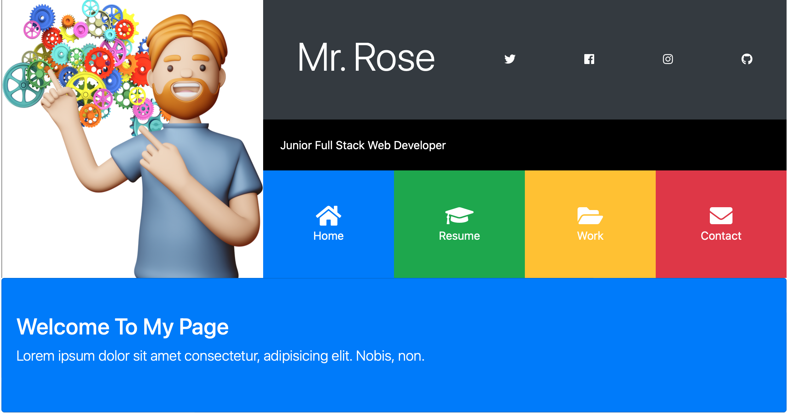

# Bootstrap Portfolio Website

- (Bootstrap Based)

  [Project link click here 🔄](https://mrgultekin.github.io/BootstraPortfoilo/)

# Student at Digital Career Institute

# Coded by ▶️ MrGultekin

# Project Start 📅 : 17.01.2022

# Project Finished 📆 20.01.2022

# Page Planning Details

- Bootstrap based components are especially collapse classes used.
- Progress bars are like striped and animated bar with % selected.
- Animation @keyframes **animations** are added.
